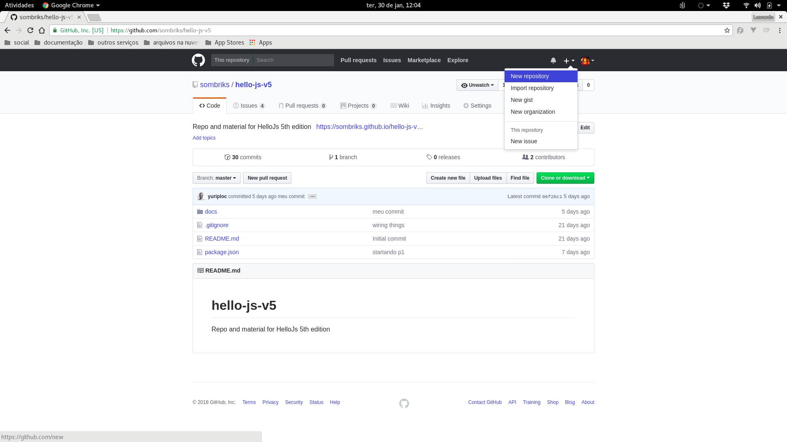
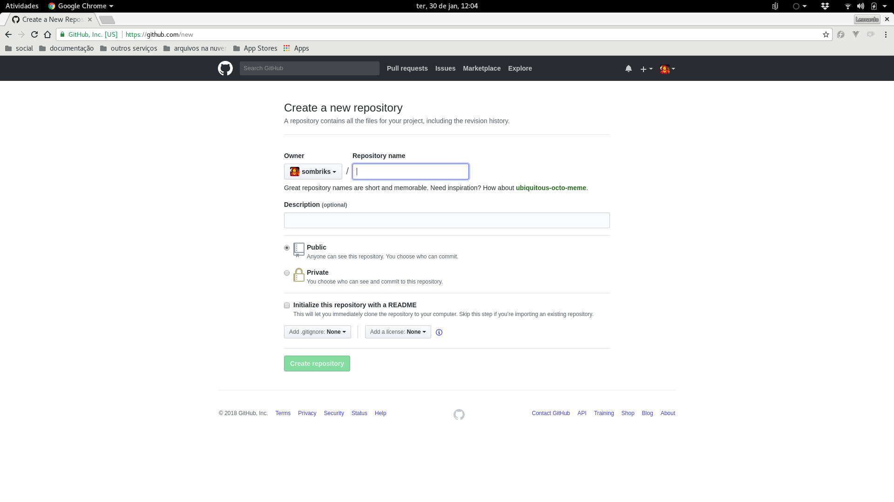
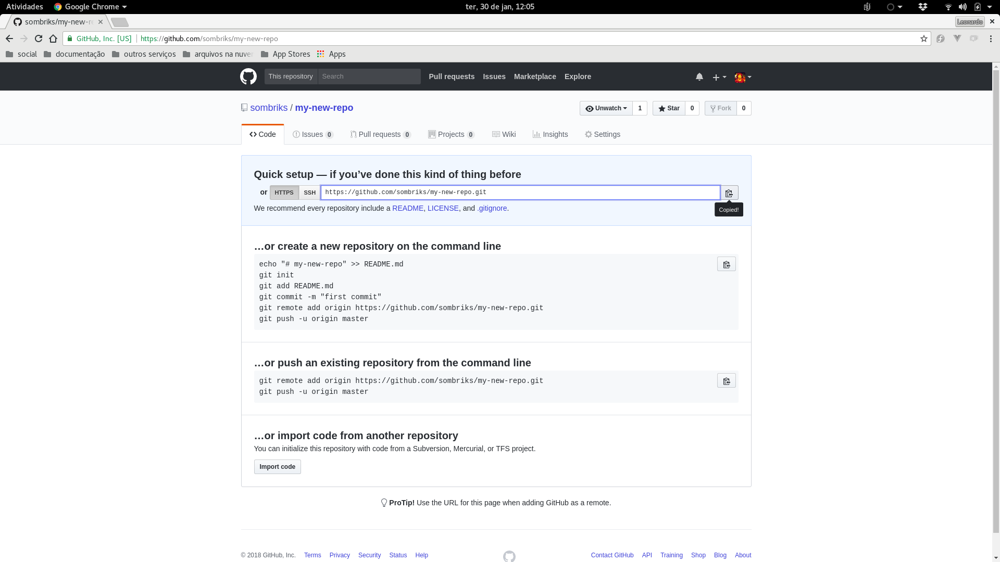
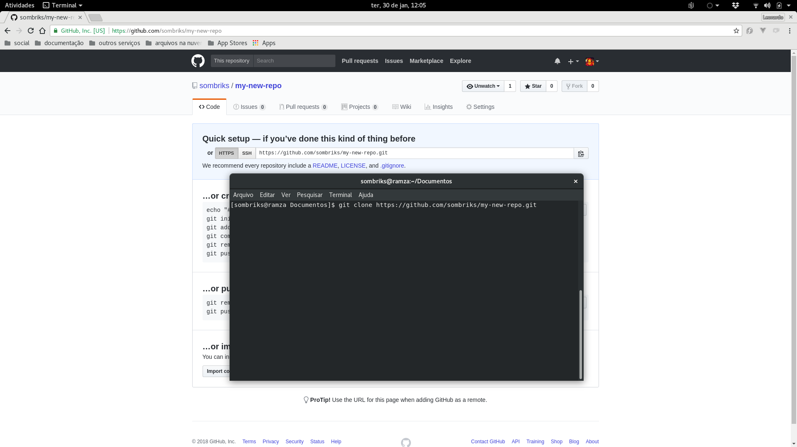
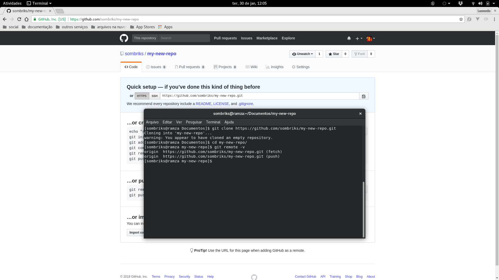

# Parte 1

Precisamos, para começar, dominar as ferramentas mais básicas de trabalho.

## Git

* Controle de versionamento de código
* Distribuído (os tais remotes)
* Árvore? Galhos?

### Workflow no *happy path*:

```bash
# recuperar todo o trabalho contido no servidor remoto
git pull
# code code code...
git add.
git commit -m "working on feature [#1234]"
git push
# and go home
```

### Configuração inicial de identidade

Importante, mas é daquelas coisas que só se faz uma vez e esquece:

```bash
git config --global user.name Fulano
git config --global user.email fulano@gmail.com
```

### Comodidade na autenticação

Se a máquina for pessoal, salve sua senha.

```bash
# editores ou IDE's mais safas terão acesso automático aos repositórios agora
git config --global credential.helper store
```

### Os remotes

Importante saber gerenciar as árvores remotas:

Listando os servidores:

```bash
git remote -v
```

Adicionando servidor:

```bash
git remote add origin git@github.com:sombriks/hello-js-v5.git
```
ou

```bash
git remote add origin https://github.com/sombriks/hello-js-v5.git
```

Tem novidade aí?

```bash
git fetch origin --prune
```

### Os galhos (branches)

Então vamos trabalhar. Atualizando o branch `master` do servidor para nossa máquina

```bash
git checkout master
git pull origin master
```

E criando o branch de trabalho (local)

```bash
git checkout -b feature/326-create-magic-function
```

E em que branch estou agora?

```bash
git branch
* feature/326-create-magic-function
  master
```

Escrevendo código.. :coffee:
Resumo das alterações?

```bash
git status
git diff -w
```

### Commit e push

Tudo certo? Vamos commitar (local)

```bash
git commit -a
```
Checando o log

```bash
git log
```
Enviando para o servidor (remoto)

```bash
git push origin feature/326-create-magic-function
```

A feature está concluída? merge nela

```bash
git checkout master
git merge feature/326-create-magic-function
```

Quer remover o branch? opção **-d**

```bash
# removing locally
git branch -d feature/326-create-magic-function
# remove from remote 'origin'
git push origin  --delete feature/326-create-magic-function
```


(By Atlassian)

## GitHub

* Open Source / Enterprise

Como saber se um projeto está bem?

* Stars
* Forks

Como contribuir para um projeto?

* Issues
* Pull Requests

E como eu posso me aproveitar disso?

* Portfólio
* GH Pages (`you`.github.io)

### Git clone

Em vez de criar primeiro a pasta local, dar git init e configurar o remote,
você pode criar o projeto pelo github.

No menu superior, selecione *new repository*:



Defina um nome para o seu projeto:



Em *quick setup*, tem um endereço https. Copie este endereço:



Abra um terminal e use o comando **git clone <endereço>**:



Ao terminar de criar a pasta, entre nela. Observe que já vem um *origin* devidamente configurado.



## Consoles

- Muito importante o domínio do console
- Com o tempo os comandos vem mais facilmente à memória
- Alguns comandos servirão de forma universal

### Cliente

Aqui no navegador (`ctrl+shift+ i`)

```javascript
>
console.log('hello, js!')
```

### Servidor

No terminal, NodeJS

```bash
node
>
```

```javascript
console.log('hello, js!')
```

É browser?

```bash
npm -version
node -version
```

É V8!

Uma das **várias** engines javascript.

## Editor de texto

Tem vários e muito bons:

- [Visual Studio Code](https://code.visualstudio.com/)
- [Atom](https://atom.io/)
- [Sublime](https://www.sublimetext.com/)
- [Geany](https://www.geany.org/)
- [Kate](https://kate-editor.org/)

Neste *crash course* vamos usar o Code, mas o editor é questão de gosto pessoal.

## Exercícios

1. Criem suas contas no github, caso ainda não tenham e respondam à issue `SE05EP01` com a str: Presente
_(05 é o número da edição atual: 01, 02, 03...)_
2. **Adicionem (follow) seus colegas de sala. Todos eles.**
3. Criem um projeto chamado **hello-js-se05-ep01**
4. Façam checkout do projeto pela linha de comando
5. Criem um novo arquivo chamado **SE05EP01.md**
6. Adicionem, façam commit e push desse arquivo
7. Criem um branch chamado **new-feature** e mudem o repositório para ele.
8. Modifiquem o SE05EP01.md dentro deste branch
9. Adicionem, façam commit e push do arquivo modificado para este branch.
10. Pra finalizar, merge do branch new-feature pro master
