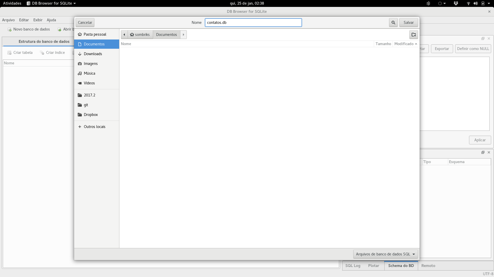
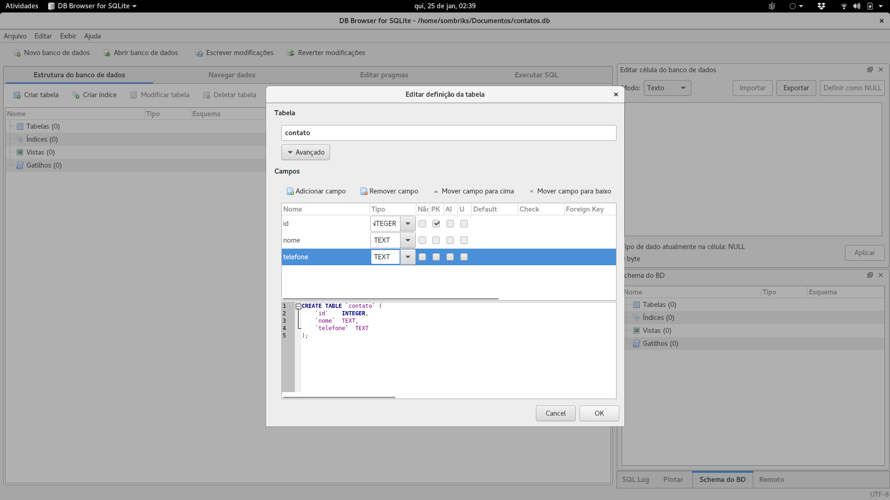
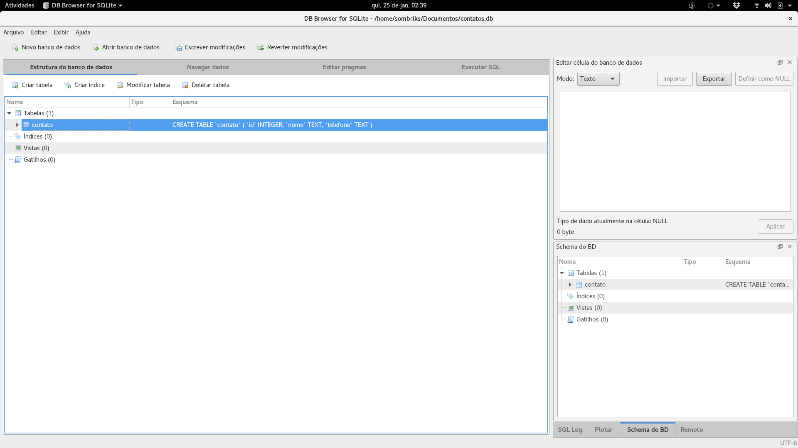

# Parte 4

Precisamos persistir dados em uma base de dados relacional.

## SQLite / dbbrowser

- Para podermos treinar SQL, precisaremos de um SGBD
- O mais didático de todos é o [SQLite](https://sqlite.org/)
- Para administrarmos os dados do banco, usaremos uma ferramenta gráfica
- [db browser](http://sqlitebrowser.org/)

### Uso básico

- Abra o db browser


- Aperte em "Novo banco de dados" e salve com um nome apropriado 
  (ex: *contatos.db*)



- Um 'assistente' de criação de tabelas eventualmente abrirá. É seguro ignorar
  ele por enquanto



- A situação atual do esquema será apresentada. Não tem muita coisa pra ver,
  ao menos por hora



- Importante: nunca esquecer de "Escrever modificações", pois sem isso os 
  dados não constarão no arquivo do banco


- Por fim, selecione a aba "Executar SQL"


### Outros SGBD's

- [PostgreSQL](https://www.postgresql.org/)
- [MySQL](https://www.mysql.com/)
- [Oracle](http://www.oracle.com/technetwork/database/enterprise-edition/downloads/index.html)
- [DB2](https://www.ibm.com/analytics/us/en/db2/trials/)
- [H2](http://www.h2database.com/html/main.html) 
- [SQLServer](https://www.microsoft.com/pt-br/sql-server/sql-server-downloads)

*"Qual é o melhor?"*

## SQL

- Structured Query Language
- Baseado na Algebra Relacional (matemática, meu chapa!)
- Bom para produzir informação em cima de uma massa de dados 
- ACID (Atomicidade, Consistência, Isolamento e Durabilidade)

Podemos dividir o SQL em DDL e DML

### Data Definition Language

- Podemos criar tabelas

```sql
-- script-1.sql
create table contato(
  idcontato integer not null primary key autoincrement,
  nomecontato varchar(255) not null,
  datacriacaocontato timestamp not null default current_timestamp
);
```

- Podemos adicionar colunas em tabelas existentes

```sql
-- script-2.sql
alter table contato add column telefonecontato varchar(255);
```

- Podemos excluir tabelas

```sql
-- script-3.sql
drop table contato;
```

- O sqlite possui limitações, mas outros bancos permitem *modificar* colunas, 
  *remover* colunas e/ou restrições. 

#### Chave primária e chave estrangeira

- O ID de uma determinada entidade (ler o 
  [paradoxo do navio de teseu](https://pt.wikipedia.org/wiki/Navio_de_Teseu#O_paradoxo)) 
  diferencia de modo absoluto uma da outra
- Entidades distintas podem se relacionar, então uma entidade guarda a chave da
  outra em uma de suas colunas

Exemplo:

```sql
-- script-4.sql
create table modelo(
  idmodelo integer not null primary key autoincrement,
  descricaomodelo varchar(255) not null 
);

create table carro (
  idcarro integer not null primary key autoincrement,
  placa varchar(255) not null,
  idmodelo integer not null,
  foreign key (idmodelo) references modelo(idmodelo) 
);
```

Relacionamento **1:N** *(um para N)*
Uma forma de ler isso é: *existem vários modelosde carro, mas um carro possui*
*apenas um modelo*

Outro Exemplo:

```sql
-- script-5.sql
create table festa(
  idfesta integer not null primary key autoincrement
  -- demais campos
);

create table convidado (
  idconvidado integer not null primary key autoincrement
  -- demais campos
);

create table festa_convidado (
  idfesta integer not null,
  idconvidado integer not null,
  foreign key (idfesta) references festa(idfesta),
  foreign key (idconvidado) references convidado(idconvidado),
  primary key (idfesta,idconvidado)
);
```

Relacionamento **N:N** *(N para N)*
*Vários convidados podem participar de várias festas*
*Mas um convidado pode participar de uma determinada festa uma única vez*

Mais um:

```sql
-- script-6.sql
create table documento(
  iddocumento integer not null primary key autoincrement
  -- demais campos
);

create table pessoa (
  idpessoa integer not null primary key autoincrement,
  iddocumento unique integer not null,
  foreign key (iddocumento) references documento(iddocumento)
  -- demais campos
);
```

Relacionamento **1:1** *(um para um)*
*Uma pessoa tem exatamente um documento de identificação*

- Devemos marcar a coluna como unique quando o valor dela não possa se repetir
- Colunas unique são indexadas, assim como as colunas de chave primária

### Data Manipulation Language

Definido o esquema de dados, podemos trabalhar com os mesmos com 4 operações:
- insert
- update
- delete
- select

Crie as tabelas abaixo usando o **dbbrowser** para podermos treinar as operações

```sql
-- script-7.sql
create table jogador (
  idjogador integer not null primary key autoincrement,
  numerojogador integer not null default 11,
  nomejogador varchar (255) not null
);

create table equipe (
  idequipe integer not null primary key autoincrement,
  nomeequipe varchar (255) not null 
);

create table escalacao (

  idjogador integer not null unique,
  idequipe integer not null,

  foreign key (idjogador) references jogador(idjogador)
  foreign key (idequipe) references equipe(idequipe)

  primary key (idjogador, idequipe)
);
```


### Insert 

```sql
-- script-8.sql
insert into jogador (numerojogador,nomejogador) values (10,'Sócrates');
insert into jogador (numerojogador,nomejogador) values (1,'Arquimedes');
insert into jogador (numerojogador,nomejogador) values (7,'Aristóteles');
insert into jogador (numerojogador,nomejogador) values (9,'Platão');
insert into jogador (numerojogador,nomejogador) values (4,'Heráclito');
insert into jogador (numerojogador,nomejogador) values (11,'Kant');
insert into jogador (numerojogador,nomejogador) values (8,'Descartes');
insert into jogador (numerojogador,nomejogador) values (8,'Nietzsche');
insert into jogador (numerojogador,nomejogador) values (9,'Schopenhauer');
insert into jogador (numerojogador,nomejogador) values (5,'Hegel');
insert into jogador (numerojogador,nomejogador) values (3,'Hume');
insert into jogador (numerojogador,nomejogador) values (2,'Hobbes');
insert into jogador (numerojogador,nomejogador) values (7,'Spinoza');
insert into jogador (numerojogador,nomejogador) values (3,'Heidegger');
insert into jogador (numerojogador,nomejogador) values (9,'Sêneca');

insert into equipe (nomeequipe) values ('Penso Logo Existo');
insert into equipe (nomeequipe) values ('Só Sei que Nada Sei');
insert into equipe (nomeequipe) values ('Vontade de Potência');

insert into escalacao (idjogador,idequipe) values (1,1);
insert into escalacao (idjogador,idequipe) values (2,1);
insert into escalacao (idjogador,idequipe) values (3,1);
insert into escalacao (idjogador,idequipe) values (4,1);
insert into escalacao (idjogador,idequipe) values (5,1);
insert into escalacao (idjogador,idequipe) values (6,2);
insert into escalacao (idjogador,idequipe) values (7,2);
insert into escalacao (idjogador,idequipe) values (8,2);
insert into escalacao (idjogador,idequipe) values (9,2);
insert into escalacao (idjogador,idequipe) values (10,2);
insert into escalacao (idjogador,idequipe) values (11,3);
insert into escalacao (idjogador,idequipe) values (12,3);
insert into escalacao (idjogador,idequipe) values (13,3);
insert into escalacao (idjogador,idequipe) values (14,3);
insert into escalacao (idjogador,idequipe) values (15,3);
```

- Insert cria *tuplas* no banco (linhas na tabela)
- Como as chaves primárias são automáticas, não épreciso informá-las
- **ATENÇÃO** execute o scprit só uma vez. Evite duplicar os dados ;-)
- Descubra como ver os dados no **dbbrowser**

### Update

```sql
-- script-9.sql
update equipe set nomeequipe = 'Alegoria da caverna' where idequipe = 3;
```

- Update altera registros
- É uma instrução destrutiva (**cuidado com os updates sem where!**) 
- Preferível usar a chave primária nos updates sempre que possível

### Delete

```sql
-- script-10.sql
delete from escalacao where idjogador = 4;
```

- Dele remove registros
- Operação destrutiva, **jamais esquecer a cláusula where** 

### Select

Agora as coisas ficam interessantes!

- Selects produzem informação
- Filtram os dados
- Agrupam
- Fazem junções

Testem as consultas abaixo no **dbbrowser**:

*Traga-me todos os jogadores.*

```sql
-- script-11.sql
select * from jogador;
```

*Todos os jogadores com id igual a 7*

```sql
-- script-12.sql
select * from jogador where idjogador = 7;
```

*Os nomes dos jogadores camisa 9*

```sql
-- script-13.sql
select nomejogador from jogador where numerojogador = 9;
```

*Os jogadores que tem 'a' no nome* (note que 'A' é diferente de 'a')

```sql
-- script-14.sql
select * from jogador where nomejogador like '%a%';
```

#### Agregadores

Funções de agregação extraem ainda mais informação dos dados.

*Conte os jogadores do time 1*

```sql
-- script-15.sql
select count(idjogador) from escalacao where idequipe = 1;
```

*Conte os jogadores camisa 11*

```sql
-- script-16.sql
select count(idjogador) from jogador where numerojogador = 11;
```

*Qual a maior numeração de camisa*

```sql
-- script-17.sql
select max(numerojogador) from jogador;
```

*Ver se existem jogadores com camisa repetida*
*Ou ainda: contar os jogadores `agrupados` pelo número da camisa*

```sql
-- script-18.sql
select 
  count(idjogador),numerojogador 
from 
  jogador 
group by 
  numerojogador
```

#### Join

Junções servem para os dados de duas ou mais tabelas para produzir informação.

*Mostre os nomes dos times e os nomes de seus respectivos jogadores*

```sql
-- script-19.sql
select 
  nomeequipe, nomejogador 
from 
  equipe, escalacao, jogador
where 
  equipe.idequipe = escalacao.idequipe
  and escalacao.idjogador = jogador.idjogador
```

Ou ainda:

```sql
-- script-20.sql
select 
  nomeequipe, nomejogador 
from 
  equipe
natural join 
  escalacao
natural join 
  jogador
```

**NOTA**: junções naturais dependem de uma odelagem muito precisa onde os nomes
das colunas são únicos em todo o esquema.

É possível combinar agregadores e junções:

*Quantos jogadores por time temos*

```sql
-- script-21.sql
select 
  nomeequipe, count(idjogador)
from 
  equipe
natural join 
  escalacao
natural join 
  jogador
group by nomeequipe
```

O SQL permite ainda ordenação, paginação e outras estruturas especiais que
veremos no decorrer do nosso percurso.

## knex.js

De volta ao javascript!

Mas o que é o **knex**? É um query builder.

Usar uma linguagem dentro da outra é, por vezes, problemático.

Em vez de usar SQL diretamente do lado javascript na forma de strings (que 
podem conter erros e tal), usamos javascipt para construir as consultas.

Na pasta do projeto npm (como? ainda não fez a pasta do projeto?) instale como
dependências o knex e o sqlite3:

```bash
mkdir hello-js-seVV-ep04
cd hello-js-seVV-ep04
npm init -y
npm install knex sqlite3 --save
touch index.js
```

Sabe o banco de dados criado para rodarmos os exemplos de SQL? coloque-o 
dentro da pasta do projeto, ao lado do **index.js**

Vamos acessar via javascript os dados desse banco usando o **knex**:

```javascript
// index.js
const knex = require("knex")({
  client: 'sqlite3',
  connection: {
    filename: "./contatos.db"
  }
})

knex("jogador").select().then(ret => {
  console.log(ret)
  process.exit(0) // finalizar execução do script
})
```

Pontos dignos de nota:
- O require do knex é um pouco diferente. Como ele retorna uma função, já 
  passamos o objeto de configuração ali mesmo e guardamos a instância do
  querybuilder
- O knex guarda um pool de conexões (*long story, tell you later*) e por isso
  o script não morre quando chega ao final. Dá um efeito parecido com o que 
  vimos no script do express, mas por razões diferentes
- Aquele **.then(...)** é a realização de uma 
  [Promessa](https://developer.mozilla.org/pt-BR/docs/Web/JavaScript/Reference/Global_Objects/Promise).
  A primeira parte, **knex("jogador").select()**, retorna uma promessa
- O argumento da realização da promessa é uma função.  


## Exercícios Node.js + SQL

1. Crie no github o projeto **hello-js-seVV-ep04** e dê checkout local
2. Inicialize o projeto npm e instale o knex e o sqlite3 como dependências
3. Dentro do projeto dele crie o arquivo **esquema-inicial.sql**
4. Use este arquivo sql para definir uma tabela chamada **contato**
5. A tabela deve conter as colunas id, nome, telefone e datacadastro
6. Use o **dbbrowser** para executar o script e criar o banco **contatos.db**
7. Garanta que o banco foi salvo dentro da pasta do projeto
8. Crie um arquivo chamado **index.js**
9. Ao executar o script, ele deverá receber até 2 argumentos. O primeiro será 
   a operação (insert, update, delete, list). O segundo argumento depende da
   operação
  1. Caso a operação seja insert fornecer nome,telefone separados por vírgula
  2. Caso seja um update, prover id,nome,telefone (ex: 1,joão,123456). Use a
     função [split](https://developer.mozilla.org/pt-BR/docs/Web/JavaScript/Reference/Global_Objects/String/split) 
     das Strings do javascript para separar valores.
  3. Em caso de delete, fornecer apenas o id
  4. No select não é preciso um segundo argumento
10. A saída, se houver, deve ser jogada no **console.log()**
11. Insira pelo menos 3 contatos: 
  1. maria,123 
  2. joão,456
  3. silvio,789
12. Use o **dbrwowser** para conferir se os três contatos foram inseridos
13. O banco **contatos.db** deve ser colocado no .gitignore
14. Faça o commit e o push do projeto
